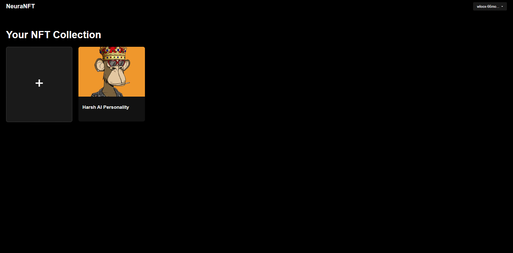

# NeuraNFT: Tokenizing Intelligence

NeuraNFT is a blockchain-based AI system built on the Internet Computer Protocol (ICP), addressing the growing need for personalized, secure, and decentralized artificial intelligence.

## Table of Contents
1. [Inspiration](#inspiration)
2. [What it does](#what-it-does)
3. [How we built it](#how-we-built-it)
4. [Getting Started](#getting-started)
   - [Prerequisites](#prerequisites)
   - [Installation](#installation)
   - [Project Setup](#project-setup)
   - [Identity Management](#identity-management)
   - [Canister Management](#canister-management)
   - [Generating Candid Interface](#generating-candid-interface)
5. [Development Workflow](#development-workflow)
6. [Demonstration](#demonstration)
7. [Litepaper](#litepaper)
8. [Overview](#overview)
9. [Challenges we ran into](#challenges-we-ran-into)
10. [Accomplishments that we're proud of](#accomplishments-that-were-proud-of)
11. [What we learned](#what-we-learned)
12. [What's next for NeuraNFT](#whats-next-for-neuranft)


## Inspiration

The inspiration for NeuraNFT stemmed from a personal desire to customize AI models to better suit individual needs. As I delved deeper into the AI landscape, I uncovered a significant market gap that revolved around the value distribution among key stakeholders in the AI ecosystem. This ecosystem comprises four primary stakeholders:

- **Data Owners**: Individuals or organizations that possess valuable data sets crucial for training AI models.
- **Model Owners**: AI researchers and developers who create and refine AI algorithms and architectures.
- **Hosting Platforms**: Infrastructure providers that offer the computational resources necessary for training and deploying AI models.
- **End Users**: Consumers or businesses that utilize AI models for various applications.

While each of these stakeholders contributes essential value to the AI ecosystem, I observed that the current market structure often fails to equitably distribute the benefits and rewards. For instance:

- Data owners often have little control over how their data is used and rarely receive direct compensation for its value.
- Model owners may struggle to monetize their innovations effectively, especially if they lack the resources for large-scale deployment.
- Hosting platforms, while essential, can sometimes extract disproportionate value due to their control over infrastructure.
- End users might face high costs or limited customization options, reducing the accessibility and applicability of AI technologies.

This realization led to the conception of NeuraNFT, a platform designed to rebalance the value proposition for all stakeholders involved. By leveraging blockchain technology and NFTs, NeuraNFT aims to:

- Provide data owners with greater control and potential for monetization of their data.
- Offer model owners a direct path to market their innovations and receive fair compensation.
- Create a more competitive and decentralized hosting environment, potentially reducing costs and increasing efficiency.
- Empower end users with more affordable, customizable, and transparent AI solutions.

Through this approach, NeuraNFT seeks to democratize AI technology, fostering a more equitable, innovative, and collaborative ecosystem that benefits all participants in the AI value chain.

## How we built it

We built NeuraNFT using a combination of blockchain technology, specifically the Internet Computer Protocol (ICP), and high-performance computing infrastructure. The system utilizes smart contracts (canisters in ICP) for managing NFTs, user authentication, and interaction with the HPC nodes.

For our AI model backend, we used Ollama to work with LLaMA 3.1 as our base model. We chose LLaMA 3.1 for its powerful language understanding capabilities and Ollama for its efficient management of large language models. To ensure scalability and ease of deployment, we containerized our Ollama setup using Docker.

We implemented a prototype using a single HPC node for AI model training, fine-tuning, and inference, with plans to transition to a fully decentralized, blockchain-based compute network in the future. This approach allowed us to demonstrate the core functionalities of NeuraNFT while laying the groundwork for a more distributed system.

## Getting Started

### Prerequisites

1. **WSL (Windows Subsystem for Linux)**: Required for using ICP SDKs and DFX SDKs on Windows. Follow [Microsoft's WSL installation guide](https://docs.microsoft.com/en-us/windows/wsl/install).

2. **Rust**: A systems programming language that's blazingly fast and memory-efficient.

3. **Node.js and npm**: JavaScript runtime and package manager for the frontend.

4. **Internet Computer SDK (DFX)**: The main tool for developing on the Internet Computer.

### Installation

1. Install DFX SDK:
   ```bash
   sh -ci "$(curl -fsSL https://internetcomputer.org/install.sh)"
   ```
   This script downloads and installs the latest version of DFX. Follow the prompts to complete the installation.

2. Install Rust (if not already installed):
   ```bash
   curl --proto '=https' --tlsv1.2 -sSf https://sh.rustup.rs | sh
   ```
   Follow the on-screen instructions to complete the Rust installation.

3. Install Node.js and npm (if not already installed):
   ```bash
   sudo apt update
   sudo apt install nodejs npm
   ```

4. Add WebAssembly target for Rust:
   ```bash
   rustup target add wasm32-unknown-unknown
   ```
   This allows Rust to compile to WebAssembly, which is necessary for ICP development.

### Project Setup

1. Initialize the project:
   ```bash
   dfx new ICP_NFTs
   cd ICP_NFTs
   ```
   This creates a new ICP project with the necessary file structure.

2. Build the project:
   ```bash
   dfx build
   ```
   This command compiles your Rust code to WebAssembly and prepares your project for deployment.

3. Create and install canisters:
   ```bash
   dfx canister create --all
   dfx canister install --all
   ```
   These commands create canister IDs for your project and install the compiled WebAssembly modules into the canisters.

4. Install frontend dependencies:
   ```bash
   cd src/ICP_NFTs_frontend
   npm install
   ```
   This installs all necessary npm packages for the frontend.

### Identity Management

In ICP, identities are used to interact with the network. Here's how to manage them:

1. Get wallet:
   ```bash
   dfx identity get-wallet
   ```
   This displays the address of the wallet associated with your current identity.

2. Generate new identity:
   ```bash
   dfx identity new my_identity
   ```
   Replace `my_identity` with your desired identity name.

3. List identities:
   ```bash
   dfx identity list
   ```
   This shows all available identities.

4. Use an identity:
   ```bash
   dfx identity use my_identity
   ```
   Switch to using the specified identity.

### Canister Management

Canisters are the computational units in ICP. Here's how to manage them:

1. View canister info:
   ```bash
   dfx canister info <canister_id>
   ```
   Replace `<canister_id>` with the ID of the canister you want to inspect.

2. Update canister settings:
   ```bash
   dfx canister update-settings ICP_NFTs_frontend --add-controller $(dfx --identity=your-identity-name identity get-principal)
   ```
   This adds a new controller to the specified canister. Replace `your-identity-name` with the identity you want to use.

### Generating Candid Interface

Candid is the interface description language for ICP. To generate the Candid interface:

```bash
cargo test --package ICP_NFTs_backend -- tests::generate_candid --exact --nocapture
```

Note: If `assetStorage.did` is not added automatically, you may need to add it manually to your project.

I## Development Workflow

1. **Start the local network**:
   ```bash
   dfx start --background
   ```

2. **Deploy your canisters**:
   ```bash
   dfx deploy
   ```

3. **Interact with your canisters**:
   Use `dfx canister call` to invoke canister methods.

4. **Update your code**:
   After making changes, rebuild and redeploy:
   ```bash
   dfx build
   dfx canister install --all --mode upgrade
   ```

5. **Stop the local network**:
   ```bash
   dfx stop
   ```

Remember to commit your changes regularly and push to your version control system.

## Demonstration

<video width="800" controls>
  <source src="./Assets/NeuraNFT.mp4" type="video/mp4">
  <p align="center">NeuraNFT</p>
</video>


## Overview

<div align="center">
  

  

   
   


   


   


   


</div>

## Litepaper

<!--  -->
[Download the project documentation](./NeuraNFT_Litepaper.pdf)

## Challenges we ran into

1. Implementing HTTPS outcalls in ICP
   - Strict requirements for HTTPS, SSL, and IPv6 connectivity
   - Explored various approaches before finding a solution

2. Efficient AI model hosting
   - Implemented package caching to reduce build times and data usage

## Accomplishments that we're proud of

- Learning and implementing new technologies (ICP, Rust)
- Iterating over various architectures
- Writing our first litepaper
- Creating a system with the potential to democratize AI ownership and usage

## What we learned

- Problem-solving from multiple angles
- Proficiency in Rust programming
- Deploying models like LLaMA on Docker
- Articulating complex technical concepts in a litepaper

## What's next for NeuraNFT

1. Transition to a distributed HPC network
2. Develop a fully blockchain-based compute system
3. Enhance NFT functionality (model composition, fractional ownership)
4. Create a decentralized marketplace for AI model NFTs
5. Implement a DAO for ecosystem governance
6. Improve interoperability with other networks and AI systems
7. Enhance privacy and security features
8. Develop an ethical AI framework and compliance tools
9. Expand AI capabilities for various data types and continuous learning
10. Focus on real-world integration (IoT, enterprise solutions)

